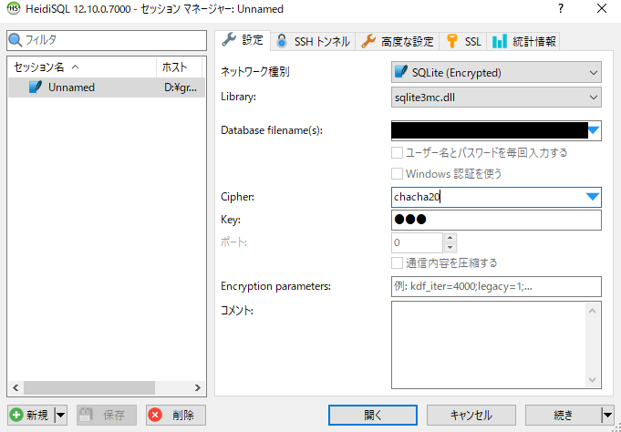
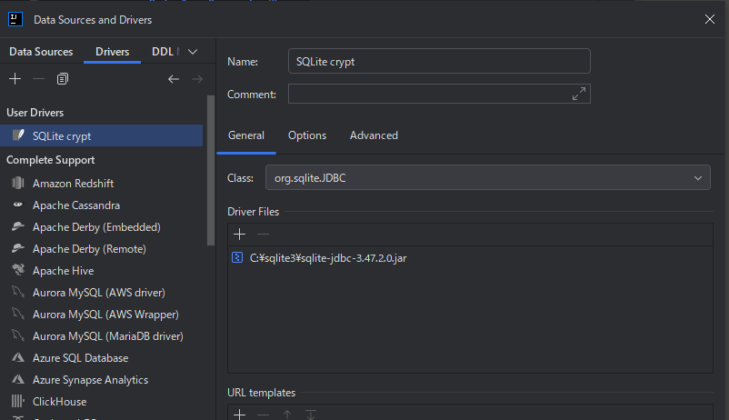
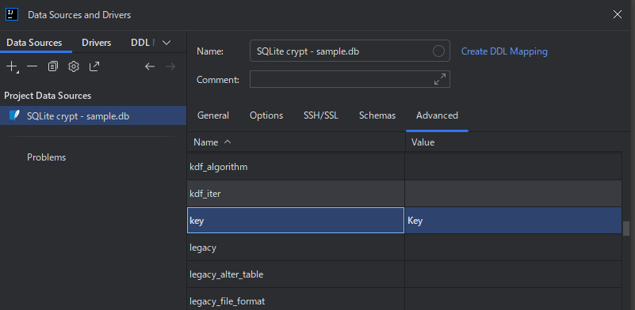

# Java での SQLite 暗号化について
SQLite3 Multiple Ciphers の Java Binding を用いて、暗号化された SQLite3 データベースを操作するサンプル

# SQLite3 の暗号化方法について整理
- SQLite Encryption Extension (SEE) (https://sqlite.org/com/see.html)
  - 商用。かなり高価。
  - ソースコードライセンスが有償。永久ライセンスで 2,000 USD
    - https://sqlite.org/purchase/see
  - 上記とは別に、System.Data.SQLite で SEE を使用するためのファイルは、年間 2,500 USD
    - https://sqlite.org/purchase/sds
    - 更にこれは NuGet パッケージなので、Java から使用したい場合はどうするべきなのか不明。
- SQLCipher (https://www.zetetic.net/sqlcipher/)
  - 商用
  - Community エディションは存在するが、公式の JDBC ドライバを使用するためには、Enterprise Support の契約が必要そう。
- SQLite3 Multiple Ciphers (https://utelle.github.io/SQLite3MultipleCiphers/)
  - オープンソース
  - 複数の暗号化をサポートする SQLite の暗号化拡張機能の実装
  - wxSQLite3、SQLCipher、System.Data.SQLite などの暗号化方式に対応。
  - デフォルトでは ChaCha20 という暗号化方式になっている。
    - SQLite3 Multiple Ciphers において、Cipher は ChaCha20 が推奨されているので特に変更しないで良さそう。
  - 複数の言語バインディングが存在しており、Java や .NET で使用可能になっている。
    - https://utelle.github.io/SQLite3MultipleCiphers/docs/installation/install_overview/#language-bindings

# クライアントソフトからの接続について
とりあえず Windows 環境のみ。

## HeidiSQL
ネットワーク種別=SQLite (Encrypted) を指定して、Cipher=chacha20、Keyを任意の値にセットすれば接続可能

## IntelliJ IDEA
SQLite3 の Driver を複製し、Driver files に、https://github.com/Willena/sqlite-jdbc-crypt からダウンロードした JDBC の Jar ファイルを指定する。  

上記で作成した Driver を指定して、新しい DataSource を作成する。(この際、Advanced タブを選択して、key 属性に、暗号化キーを指定する)

